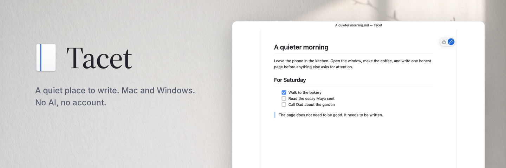
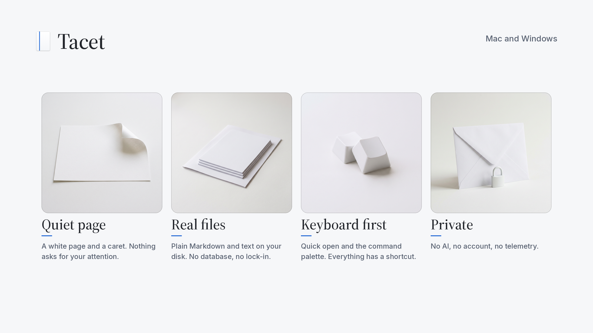
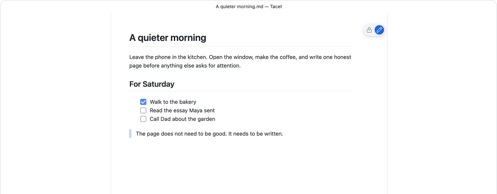

<p align="center">
  <picture>
    <source media="(prefers-color-scheme: dark)" srcset=".github/assets/tacet-banner-dark.png">
    
  </picture>
</p>

<p align="center">
  <a href="#build-and-run">Build from source</a> ·
  <a href="https://www.mazenzwin.com">Website</a> ·
  <a href="LICENSE.txt">MIT (with one exception)</a>
</p>

Tacet opens to a white page with a caret, and you write. Your notes are real files on your disk, Markdown reads like a page instead of a pile of symbols, and a terminal is there when you turn it on. There is no AI, no account and no telemetry.

*Tacet* is the mark in a score that tells a player to stay silent. The app does the same: it stays out of the way.

> **Status: early.** Development builds run on macOS (Apple silicon) and Windows (x64). There is no signed release yet. Build it from source below, and expect rough edges.

<p align="center">
  <picture>
    <source media="(prefers-color-scheme: dark)" srcset=".github/assets/tacet-pillars-dark.png">
    
  </picture>
</p>

<p align="center">
  
</p>

## How it works

| 1. Open | 2. Write | 3. Save |
| --- | --- | --- |
| Open a `.md` or `.txt` file, or start a new note. | A rendered, editable page with the caret ready. Source view is one key away. | Cmd/Ctrl+S writes an ordinary file. Durable drafts and autosave are next on the [plan](tacet/SHIP-PLAN.md) (M5). |

## Tacet is for you if

- You want a notes app that is **just a page**, not a workspace, vault or dashboard.
- You like **Markdown**, but you would rather read it than stare at `#` and `*`.
- You edit the files your coding agents read (`AGENTS.md`, `CLAUDE.md`, rule files) and want a plain, safe editor for them.
- You want **keyboard-first** editing with the precision of VS Code's text engine.
- You want your writing to stay **on your computer**, in files you own.

## What Tacet is not

| Not | Because |
| --- | --- |
| An IDE | No debugger, no tasks, no test runner, no source control. |
| An AI editor | No models, no chat, no completions. Nothing you write is sent anywhere. |
| A cloud notes service | No account, no sync server. Use any folder, synced or not. |
| An extension marketplace | Built-in features only. |

## Build and run

One `main` branch builds both platforms. Node must match [`.nvmrc`](.nvmrc).

**macOS** (Apple silicon or Intel, Xcode command line tools):

```sh
nvm use
VSCODE_INSTALL_CONCURRENCY=3 npm ci
npm run compile
./scripts/code.sh                                  # run the dev build
node tacet/tools/smoke.mjs mac --skip-prelaunch    # smoke gate: type, save, undo, terminal
node tacet/tools/durability.mjs mac --skip-prelaunch   # G2 durability gate: drafts and files cannot be lost
npm run gulp vscode-darwin-arm64-min               # package Tacet.app (next to the repo folder)
```

**Windows** (x64, Visual Studio 2022 with the C++ workload and Spectre-mitigated libraries):

```powershell
nvm use 24.18.0
$env:VSCODE_INSTALL_CONCURRENCY=3; npm ci
npm run compile
.\scripts\code.bat
node tacet\tools\smoke.mjs win --skip-prelaunch
node tacet\tools\durability.mjs win --skip-prelaunch
npm run gulp vscode-win32-x64-min
```

An 8 GB Mac can build Tacet; installs take a while the first time.

## Project layout

| Path | What it is |
| --- | --- |
| [`tacet/`](tacet) | Product docs, design system, ship plan and the smoke gate ([`tacet/SHIP-PLAN.md`](tacet/SHIP-PLAN.md) is the plan of record). |
| `src/vs/workbench/contrib/tacet/` | Tacet's workbench shell: title bar, page, identity. |
| `extensions/tacet-welcome/` | First boot (a small React webview). |
| `extensions/theme-tacet/` | Tacet Light, Tacet Dark and a high-contrast theme. |
| `extensions/markdown-language-features/` | The rich Markdown page (write, read, source). |

## Telemetry

None. Tacet has no telemetry, crash reporting or usage tracking; the upstream telemetry and AI services are removed from the source. A full no-network audit of the packaged app is part of the 1.0 release gate.

## Contributing

Bug reports and pull requests are welcome. Start with [CONTRIBUTING.md](CONTRIBUTING.md). Report security issues privately: see [SECURITY.md](SECURITY.md).

## License

Tacet is MIT licensed, with one exception: a few first-boot UI components from Animate UI are "MIT + Commons Clause". Details are in [LICENSE.txt](LICENSE.txt).

Tacet is built on [Code - OSS](https://github.com/microsoft/vscode), Copyright (c) Microsoft Corporation, under the MIT License. Tacet is not affiliated with or endorsed by Microsoft. Visual Studio Code is a trademark of Microsoft Corporation.

Made by [Mazen Zwin](https://www.mazenzwin.com).
