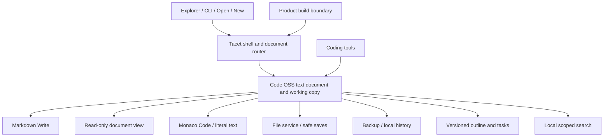

# Architecture and module ownership

## 1. One fork, one document system

Use the pinned Code OSS repository. Keep its TypeScript/Electron architecture, text-file service, working-copy backup, Monaco, language services, command system, extension host, file watching, search, Git, terminal, accessibility, and Windows shell integration where they serve the product.

The inspected upstream already contains `@vscode/markdown-editor` and a custom text editor implementation. Integrate and qualify that before adopting another editor. Do not introduce a second Electron shell, a Tauri rewrite, a web-only substitute, a second document store, or a new framework across the workbench.

Recommended product integration: a small Tacet workbench contribution for shell/lifecycle/native menus; a built-in Tacet extension for file shelf and document navigation where stable extension APIs suffice; narrow changes to the existing rich Markdown host/view for mode controls and visual styling. Keep core behavior in the relevant upstream service, not in CSS injection or a webview workaround.



## 2. Modules

| ID / module | Owns | Source integration | Must not own | Acceptance |
| --- | --- | --- | --- | --- |
| M01 Product distribution | Identity, defaults, packaged extension list, platform resources, source pin | `product.json`, `resources/`, `build/`, proposed `margin/build/` | User document state | Unique profile, reproducible artifact, retained notices |
| M02 AI removal boundary | Explicit removed contributions, dependency graph, disabled external AI protocol surface, audit manifest | Workbench entry points, extension API, platform services, package graph | Keyword-based pretending that code is absent | Artifact/runtime tests in no-AI spec |
| M03 Document router | Resource identity, file type/capability/size routing, one-model view changes | Editor resolver/custom editor services | File writes or independent content copy | Same model/version in all views |
| M04 Markdown surface | Rich Write, Read protection, source mapping, Markdown rendering fidelity | `extensions/markdown-language-features/markdown-editor-src/` | A second undo/save/recovery engine | Round-trip + IME + accessibility suite |
| M05 Files and drafts | Draft lifecycle, Save As identity transfer, shelf metadata | Text-file/working-copy/backup services; small Tacet adapter | Copy-and-hide export algorithm | Crash/cancel/error Save As cases |
| M06 File navigation | Draft/recent/folder UI, Open Documents, locate/reveal/rename actions | Proposed `extensions/tacet/`; native views where sufficient | File content authority | Stable paths, safe rename, keyboard traversal |
| M07 Document structure | Heading/task/link ranges, active-section state | Existing Markdown language service first | Regex-only parser as canonical AST | Stale range safety and syntax fixtures |
| M08 Local search | Query scope, cancellation, snippets, match-to-source mapping | Existing search/ripgrep services plus draft/open-buffer adapter | Embeddings, background home-folder scan | Scope and cancellation tests |
| M09 Recovery/compare | Current backup, history UI, external conflict workflow | Existing backup, working-copy, local-history, diff services | Unqualified custom filesystem protocol | Fault-injection acceptance |
| M10 Coding workspace | Deliberate layout reveal, Git/terminal/debug/language tools, restore writing layout | Existing workbench contributions | AI activation or hiding running terminal state | Useful code workflow and return |
| M11 Design/accessibility | Theme tokens, document typography, icon resources, focus/keyboard behavior, compact layout | Native theme registries and rich editor CSS | DOM monkey patches against upstream private markup | Screens/contrast/Windows scaling audit |
| M12 Delivery/qualification | Windows package, update/signing lane, QA artifacts, SBOM, performance receipts | Existing build/packaging with bounded runners | Claiming tests prove untested platforms | Signed release and upgrade/rollback drill |

These are ownership boundaries inside one repository. Do not create twelve npm packages or microservices. Introduce new files in upstream layers only when responsibilities require it.

### Coding capability boundary

Publish a tested capability matrix before G5. Initial target: Markdown/plain text, JSON, HTML/CSS, JavaScript/TypeScript editing; integrated PowerShell/Command Prompt; installed Git integration; and reviewed conventional JavaScript debugging where its distribution license and built-in packaging permit it. Syntax coloring is not a promise of completion, diagnostics, a debugger, or an installed runtime for every language.

Use the user's installed shells, Git, and language runtimes through existing explicit settings. Do not download compilers/package managers automatically. Missing tools get an accurate explanation and setup documentation. Python/.NET/other ecosystem expansion depends on a reviewed extension distribution policy after v1; removing the marketplace must not leave buttons that pretend those capabilities are installed. Test this matrix against the actual packaged built-ins and licenses.

## 3. Inspected source map

- `src/vs/workbench/workbench.common.main.ts`: imports chat, inline chat, MCP, voice, welcome, conventional tools, and service registrations. Removing a single UI import does not remove the transitive AI graph.
- `src/vs/workbench/workbench.desktop.main.ts`: desktop-specific agent/MCP services and contributions.
- `src/vs/code/electron-main/app.ts`: constructs `ElectronAgentHostStarter` and `AgentHostProcessManager`; removal must include the native side, not just renderer UI.
- `src/vs/code/electron-utility/sharedProcess/sharedProcessMain.ts`: MCP/remote-agent related channels/services need a separate audit.
- `src/vs/workbench/api/browser/extensionHost.contribution.ts`: registers chat/language-model/tool/embedding/MCP main-thread participants alongside ordinary editing APIs.
- `src/vs/workbench/services/chat/common/chatEntitlementService.ts`: entitlement requests, context keys, and state. Product settings alone do not constitute removal.
- `extensions/markdown-language-features/src/preview/markdownEditorProvider.ts`: authoritative document bridge, version/epoch edits, CSP, local resources, view initialization.
- `extensions/markdown-language-features/src/preview/recoveringTaskQueue.ts`: ordered edits and recovery barriers; includes `drain()`.
- `extensions/markdown-language-features/markdown-editor-src/editor.ts`: EditorModel/View/Controller, source edits, native undo forwarding, saved selection/scroll.
- `extensions/markdown-language-features/markdown-editor-src/markdownEditor.css`: existing visual integration seam.
- `extensions/markdown-language-features/src/test/markdownEditorProvider.test.ts`: targeted host tests; extend the relevant suite instead of replacing it with screenshots.
- `build/npm/dirs.ts` and `build/npm/postinstall.ts`: installation graph and concurrency. Upstream includes Copilot and up to eight parallel package installations.
- `build/next/`: transpile/bundle path; `scripts/code.bat`: development launcher. Do not run a watch task when a one-shot build suffices.

## 4. Document interface contracts

Prefer existing API equivalents. If an adapter is needed, these are the logical operations:

```ts
type DocumentMode = 'write' | 'read' | 'code';
interface SourceAnchor { offset: number; version: number; }
interface DocumentCapabilities {
  canEdit: boolean;
  canRenderMarkdown: boolean;
  canSaveToCurrentResource: boolean;
}
// Conceptual boundary, not new public API to implement verbatim:
// open(resource) -> one existing working copy or new working copy
// switchMode(resource, mode, anchor) -> drain edits, preserve identity
// save(resource, expectedBaseline) -> acknowledged version or conflict/error
// saveAs(draft, destination) -> coordinated identity transfer
// inspect(resource, sourceVersion) -> headings/tasks/links for that version
// recover(record) -> preserved document plus optional original comparison
```

The bridge validates message types, source versions, ranges, current document identity, and mode capabilities. Never expose generic `executeCommand`/filesystem/network RPC from a Markdown webview. A toolbar sends a small allowlisted action with the current document identity, and the host validates it. HTML content cannot dispatch host commands through document links.

## 5. State placement

| State | Authority / location | Lifetime |
| --- | --- | --- |
| Saved text | User's chosen file | User controlled |
| In-flight text and undo | Native document/working copy | Open document/session |
| Recoverable draft/current backup | Native app-profile backup storage | Until safely saved/discarded |
| Recent/folder membership | Product profile metadata | User can clear; no source deletion |
| Mode/caret/scroll/layout | Per-resource profile view state | Restored across launches |
| Structure and search indexes | Rebuildable local cache | Invalidated by version/scope change |
| Historical revisions | Existing local-history storage | Visible retention policy |
| Product defaults | Source/distribution config | Versioned with build |

Product profiles are separate from Microsoft VS Code, VSCodium, Cursor, and existing user extensions. Never silently migrate their settings or credentials. A future import must preview what is being imported and filter obsolete/AI settings.

## 6. Important upstream differences to resolve

- The current rich editor stores its read-only preference globally. Tacet requires a per-document mode and new drafts always writable. Fix the ownership; do not just force a global default.
- The inspected rich webview allows HTTPS image/media sources. Tacet requires explicit external-resource policy to prevent opening a note from phoning home.
- Upstream has AI services injected into non-AI components. Remove a contribution only after mapping its consumers. Split shared utility code or supply a narrow typed unsupported capability where needed; never use a generic Proxy returning no-ops for every method.
- The draft extension sketch uses simple file copies and a regex inspector. Both are rejected as final implementations for persistence and Markdown structure.
- A theme/default-settings extension cannot by itself remove native AI processes or package dependencies.

## 7. Build and maintenance policy

Pin source, Node, Electron, and dependency lockfiles. Keep product patches small and documented by module. Obtain an unmodified baseline launch before source removal so a native toolchain error is not mistaken for a product regression.

Build one native target at a time on this 16 GB laptop. Begin with two installation jobs, bounded Node heap, and one compiler/bundler process; inspect free memory before heavy work. Do not launch swarms or parallel Electron test fleets. Reuse the installed browser for checks.

For each upstream update: read security/release changes; apply the explicit product patch stack; regenerate dependency graphs/SBOM; run AI audit, document fixtures, Windows smoke, and performance comparison. Pin old builds only for rollback, not indefinitely as a way to avoid AI removal. Signing keys, publishing, and releases have explicit owner gates.
